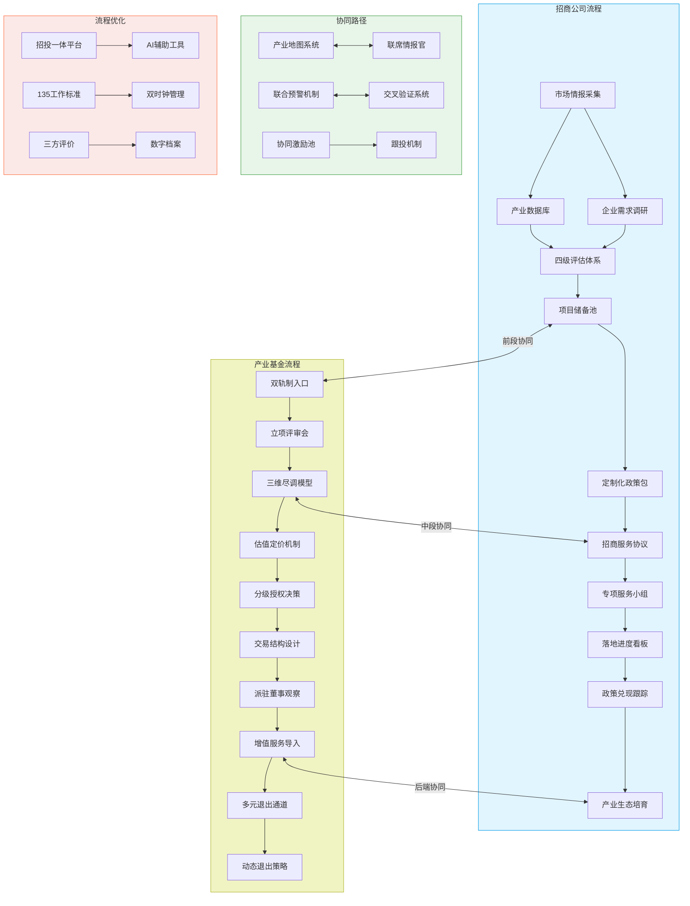

```mermaid
graph TD

subgraph "招商公司流程"
  A1[市场情报采集] --> A2[产业数据库]
  A1 --> A3[企业需求调研]
  A2 --> A4[四级评估体系]
  A3 --> A4
  A4 --> A5[项目储备池]
  A5 --> B1[定制化政策包]
  B1 --> B2[招商服务协议]
  B2 --> C1[专项服务小组]
  C1 --> C2[落地进度看板]
  C2 --> D1[政策兑现跟踪]
  D1 --> D2[产业生态培育]
end

subgraph "产业基金流程"
  E1[双轨制入口] --> E2[立项评审会]
  E2 --> F1[三维尽调模型]
  F1 --> F2[估值定价机制]
  F2 --> G1[分级授权决策]
  G1 --> G2[交易结构设计]
  G2 --> H1[派驻董事观察]
  H1 --> H2[增值服务导入]
  H2 --> I1[多元退出通道]
  I1 --> I2[动态退出策略]
end

subgraph "协同路径"
  X1[产业地图系统] <--> Y1[联席情报官]
  A5 <-->|前段协同| E1
  F1 <-->|中段协同| B2
  H2 <-->|后端协同| D2
  J1[联合预警机制] <--> J2[交叉验证系统]
  K1[协同激励池] --> K2[跟投机制]
end

subgraph "流程优化"
  O1[招投一体平台] --> O2[AI辅助工具]
  P1[135工作标准] --> P2[双时钟管理]
  Q1[三方评价] --> Q2[数字档案]
end

classDef company fill:#E1F5FE,stroke:#039BE5
classDef fund fill:#F0F4C3,stroke:#AFB42B
classDef synergy fill:#E8F5E9,stroke:#43A047
classDef optimize fill:#FBE9E7,stroke:#FF7043

class 招商公司流程 company
class 产业基金流程 fund
class 协同路径 synergy
class 流程优化 optimize

```